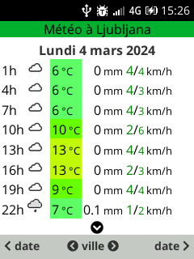
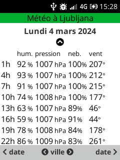
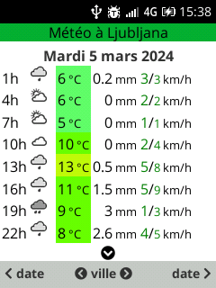
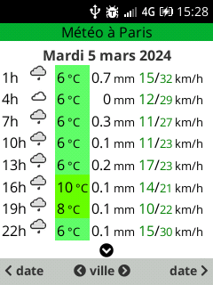

# KaiOs meteo

This application display the meteo in different cities that can be choosen by éditing the `/sdcard1/apps/meteo/config.json` file :

```
{
  "cities":[
  	{	"choiceList_label":"à Paris",
  		"location":"48.8589101,2.3119547",
  		"choiceList_type":"BOOLEAN"
  	},
  	{	"choiceList_label":"à Ljubljana",
  		"location":"46.06569339288593,14.503865423626841",
  		"choiceList_type":"BOOLEAN"
  	}
  ]
}
```
The main screen gives the meteo feeling, temperature, rain quantity and mean/max wind speed :

  

The second screen (accessible with the `ArrowDown` key) gives thehumidity, pressure, global cloudiness, wind direction and snow risk :

  

The `ArrowDown` key gives access back to the main screen

The forecast date can be choosen with the `SoftRight` and `SoftLeft` keys :

  

The city can be choosen with the `ArrowLeft` and `ArrowRight` keys :

  


#TBD

- If snow, make snow icon blinking in alternate with cloud icon
- Add an interface :
	- to add a city here
	- to add a city giving its coordinates
	- to add a city with the CARTO app

